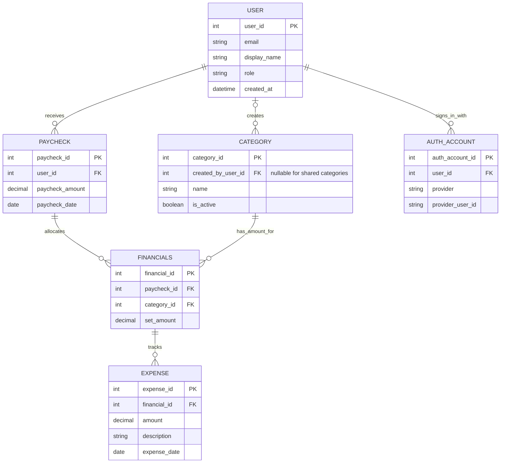

# Budget Tracker ERD

```mermaid
erDiagram
    USER ||--o{ PAYCHECK : receives
    PAYCHECK ||--o{ FINANCIALS : allocates
    CATEGORY ||--o{ FINANCIALS : has_amount_for
    FINANCIALS ||--o{ EXPENSE : tracks
    USER ||--o{ AUTH_ACCOUNT : signs_in_with
    USER o|--o{ CATEGORY : creates

    USER {
        int user_id PK
        string email
        string display_name
        string role
        datetime created_at
    }

    PAYCHECK {
        int paycheck_id PK
        int user_id FK
        decimal paycheck_amount
        date paycheck_date
    }

    FINANCIALS {
        int financial_id PK
        int paycheck_id FK
        int category_id FK
        decimal set_amount
    }

    CATEGORY {
        int category_id PK
        int created_by_user_id FK "nullable for shared categories"
        string name
        boolean is_active
    }

    EXPENSE {
        int expense_id PK
        int financial_id FK
        decimal amount
        string description
        date expense_date
    }

    AUTH_ACCOUNT {
        int auth_account_id PK
        int user_id FK
        string provider
        string provider_user_id
    }
```
